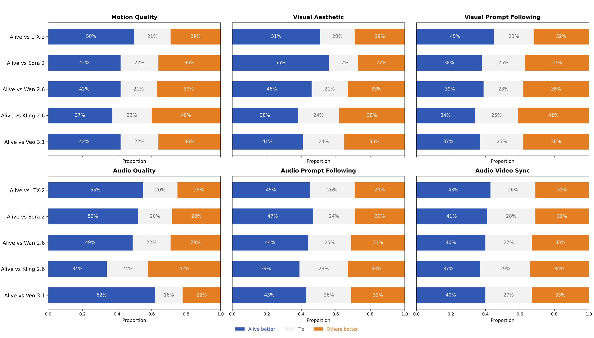
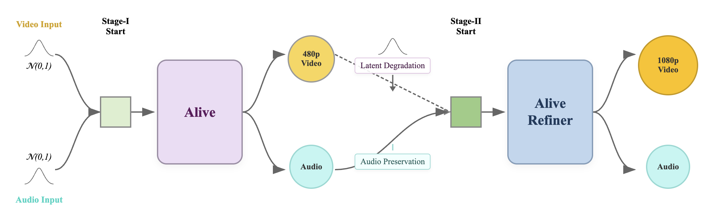
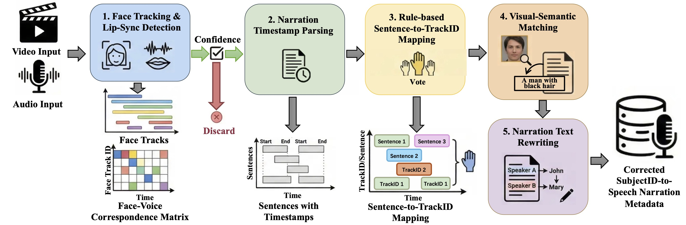
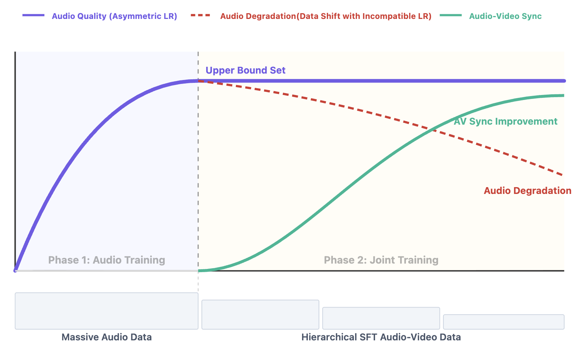
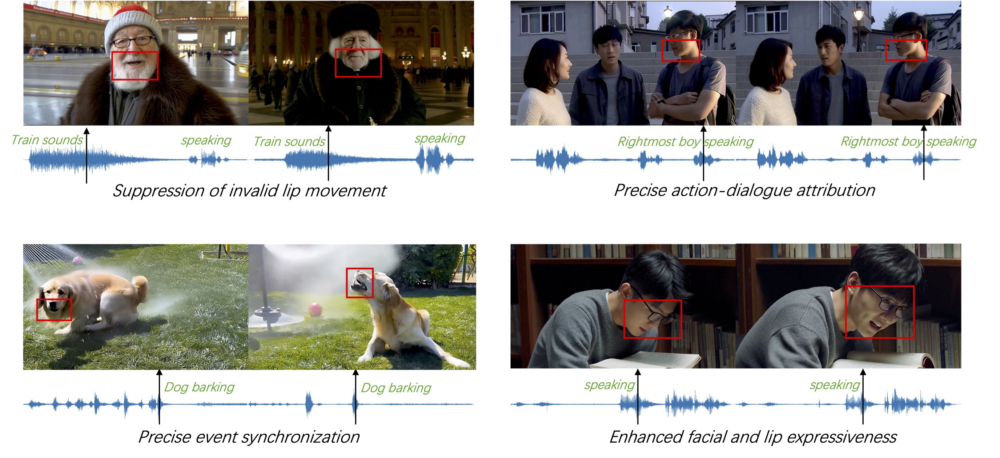

# Alive: Animate Your World with Lifelike Audio-Video Generation

<p align="center">
  
</p>

<p align="center">
  📄 <a href="https://arxiv.org/abs/2512.21734" target="_blank"><strong>Technical Report</strong></a> &nbsp;|&nbsp;
  🌊 <a href="https://foundationvision.github.io/AlivePage" target="_blank"><strong>Project Page</strong></a> &nbsp;|&nbsp;
  🎬 <a href="#" target="_blank"><strong>Online Demo (Coming Soon)</strong></a>
</p>

---

## Overview

**Alive** is a unified audio-video generation model that adapts pretrained Text-to-Video (T2V) models to audio-video generation and animation. Built on the MMDiT architecture, it achieves industry-grade performance for lifelike audio-video generation and animation.

### Key Features

- **🎬 Unified Audio-Video Generation**: Simultaneously supports Text-to-Video&Audio (T2VA) and Reference-to-Video&Audio (animation) within a single framework.
- **⚙️ Advanced Architecture**: Features TA-CrossAttn for temporally-aligned cross-modal fusion and UniTemp-RoPE for precise audio-visual alignment.
- **📊 High-Quality Data Pipeline**: Comprehensive audio-video captioning and quality control for million-level training data.
- **🏆 SOTA Performance**: Consistently outperforming open-source models and matching or surpassing state-of-the-art commercial solutions.

---

## Demo Video

<p align="center">
  <a href="https://www.youtube.com/watch?v=VtBKDvsGTDQ" target="_blank">
    
  </a>
</p>

---

## Benchmark Evaluation

### Alive-Bench 1.0

We introduce a comprehensive benchmark for joint audio-visual generation that evaluates model performance along three complementary axes—motion quality, visual aesthetic, visual prompt following, audio quality, audio prompt following and audio video synchronization—covering 20+ fine-grained dimensions. This design enables diagnostic evaluation: our benchmark pinpoints which capability fails and why. Crucially, our benchmark is built around usage-like prompts that closely mirror how end users actually describe desired content. As a result, the benchmark reduces the common evaluation–deployment mismatch, where strong offline metrics fail to translate into perceived quality in real applications.

<table>
  <tr>
    <td><video src="https://github.com/user-attachments/assets/fe626e8c-febe-4461-9e69-fa3dbe59a919" width="100%" controls autoplay loop></video></td>
    <td><video src="https://github.com/user-attachments/assets/ae7e892a-9eca-4113-8fac-ad226f2bde5d" width="100%" controls autoplay loop></video></td>
    <td><video src="https://github.com/user-attachments/assets/22b10cb3-f313-4f0a-ba4c-ce4237219ec3" width="100%" controls autoplay loop></video></td>
  </tr>
  <tr>
    <td><video src="https://github.com/user-attachments/assets/cc656451-caa4-4387-88a1-f3920d078613" width="100%" controls autoplay loop></video></td>
    <td><video src="https://github.com/user-attachments/assets/a32add44-21f2-46e2-b1e0-047a3635ffad" width="100%" controls autoplay loop></video></td>
    <td><video src="https://github.com/user-attachments/assets/6a625eb7-b66f-40b6-8c17-d7621e56d29d" width="100%" controls autoplay loop></video></td>
  </tr>
  <tr>
    <td><video src="https://github.com/user-attachments/assets/6024d16c-f5c3-4d8a-a63c-8005885f2e21" width="100%" controls autoplay loop></video></td>
    <td><video src="https://github.com/user-attachments/assets/a7cd649b-0fc7-4731-a436-6e4ede5f649e" width="100%" controls autoplay loop></video></td>
    <td><video src="https://github.com/user-attachments/assets/e0677a85-70fc-4268-a43d-3a3a73374032" width="100%" controls autoplay loop></video></td>
  </tr>
</table>

### Comparison with SOTA

We conducted extensive two-round human evaluations to benchmark our model's performance against leading competitors (Veo 3.1, Kling 2.6, Wan 2.6, Sora 2, and LTX-2). Across all metrics, **Alive** ranks at or near the top, indicating a well-balanced capability profile rather than a single-metric advantage. **Alive** is the best on audio prompt following and audio video synchronization, outperforming other competitors by a notable margin. This indicates a strong advantage in cross-modal understanding and alignment, particularly in faithfully reflecting audio instructions and maintaining tight timing correspondence between audio events and visual content.

<p align="center">
  
</p>

---

## Introduction of Alive

**Alive** is an unified audio-video generation model that excels in text-to-video&audio (T2VA), image-to-video&audio (I2VA), text-to-video (T2V), and text-to-video (T2A) generation. It offers flexible resolution and aspect ratio, arbitrary video length, and extensible for character-reference audio-video animation.

### Joint Audio-Video Modeling

We propose **Alive**, a joint generation architecture that seamlessly integrates Audio and Video DiTs via an extended "Dual Stream + Single Stream" paradigm. To resolve temporal granularity mismatches, we introduce **UniTemp-RoPE** and **TA-CrossAttn**, which map heterogeneous latents into a shared continuous temporal coordinate system, enforcing physical-time alignment for synchronized audio-visual generation.

<p align="center">
  
</p>

**Model Parameters**

| Model | Model Size | M | N | Input Dim. | Output Dim. | Num. of Heads | Head Dim |
|-------|------------|---|---|------------|-------------|---------------|----------|
| VideoDiT | 12B | 16 | 40 | 36 | 16 | 24 | 128 |
| AudioDiT | 2B | 32 | – | 32 | 32 | 24 | 64 |

### Audio-Video Refiner

The proposed cascaded audio-video (AV) refiner leverages a 480p base model to efficiently enable 1080p audio-video generation without excessive computational cost. On the video side, low-resolution inputs are refined to high-resolution outputs, effectively mitigating generative artifacts. For audio, the approach preserves both fidelity and audio-visual synchronization by inputting clean audio latents into a frozen Audio DiT module, thereby maintaining the quality and audio-video sync established by the base model.

<p align="center">
  
</p>

### Comprehensive Audio-Video Data Pipelines

Going beyond conventional visual quality filtering, our work introduces a comprehensive data pipeline for joint audio-visual generation. It performs dual-quality filtering on both audio and video modalities, and employs a joint **visual + audio** keyword labeling system to associate a single visual object with its diverse range of audio events, enabling a more sophisticated level of audio-visual data balancing. Furthermore, we optimize and correct the Subject-Speech correspondence in multi-person and multi-shot scenarios, significantly enhancing character identity consistency and accuracy.

<p align="center">
  
</p>

### Role-Playing Animate

We introduce a cross-pair pipeline and a unified-editing-based reference augmentation pipeline to robustly decouple identity from static appearance, effectively mitigating copy-paste bias. Furthermore, we develop a multi-reference conditioning mechanism with a dedicated temporal offset and a dual-conditioning CFG strategy, enabling the model to treat reference images as persistent identity anchors rather than temporal frames, thus achieving superior identity consistency and motion dynamics.

<table>
  <tr>
    <td><video src="https://github.com/user-attachments/assets/c3e79213-ec5a-4ed0-aa54-9ba0bee817c5" width="100%" controls autoplay loop></video></td>
    <td><video src="https://github.com/user-attachments/assets/9360124a-4b37-40a4-984e-959892dfe32a" width="100%" controls autoplay loop></video></td>
  </tr>
  <tr>
    <td><video src="https://github.com/user-attachments/assets/16268061-080b-4b37-b69b-9974f7ef3d8a" width="100%" controls autoplay loop></video></td>
    <td><video src="https://github.com/user-attachments/assets/f86afe0c-b88c-4f58-842d-3132a8fa594b" width="100%" controls autoplay loop></video></td>
  </tr>
</table>

### Training Recipe

**The Importance of Audio Training:** The initial AudioDiT pre-training quality (e.g., tone authenticity, pronunciation accuracy, emotional consistency) sets the upper bound for audio performance in joint generation. Joint training primarily facilitates audio-visual synchronization, with limited impact on the fundamental audio quality. Therefore, inadequate audio pre-training cannot be meaningfully improved during subsequent joint training. **Audio Sensitivity and Forgetting:** The audio branch is highly sensitive to changes in training data distribution and quickly adapts, often leading to catastrophic forgetting of previously learned robust audio features. To address this, asymmetric learning rates are used to prevent audio quality degradation during joint training.

<p align="center">
  
</p>

### Inference Optimization

The Audio DiT and Video DiT are each guided by two distinct conditions: the text prompt and cross-attention signal. The introduction of cross-attention provides a mutual signal that steers the model toward audio-video synchronization. To effectively utilize this secondary cross-attention condition, we adopt a multi-condition control scheme, treating the text prompt (positive *c<sub>pos</sub>* / negative *c<sub>neg</sub>*) and the mutual cross-attention signal (*c<sub>mutual</sub>*) as separate, controllable conditions for guidance.

<p align="center">
  
</p>

---

## Citation

If you find our work useful for your research, please consider citing:

```bibtex
@article{alive,
  title={Alive: Animate Your World with Lifelike Audio-Video Generation},
  author={ByteDance Alive Team},
  journal={arXiv preprint},
  year={2026}
}
```
